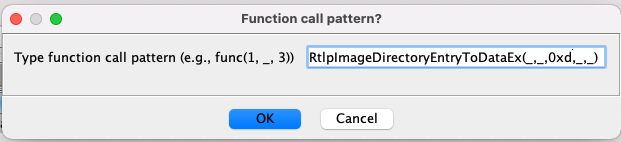
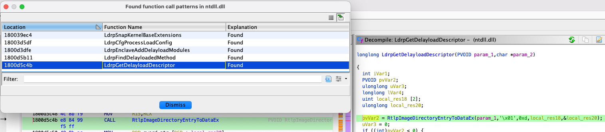

# Ghidra scripts

This repository contains some Ghidra scripts to automate my reverse-engineering tasks.

## About scripts in this repo

### [CalcCyclomaticForAllFunctions.py](./CalcCyclomaticForAllFunctions.py)

This script calculates the Cyclomatic complexities for all functions of the current program.
It can be used for finding the complex functions.

### [FindFrequentlyUsedFunctions.py](./FindFrequentlyUsedFunctions.py)

This script shows the frequently-called functions.

### [SearchFunctionCallPattern.py](./SearchFunctionCallPattern.py)

This script searches the function call sites passing a specific value.

For example, consider the case where you want to look for the function call of `RtlpImageDirectoryEntryToDataEx()` whose third argument is `IMAGE_DIRECTORY_ENTRY_DELAY_IMPORT` (0xd).

By using this script, you can search such a call site by typing `RtlpImageDirectoryEntryToDataEx(_, _, 0xd, _, _)`

Then, you can get the result as follows.

### [TestSymbolicPropagator.py](./TestSymbolicPropagator.py)

This script is for testing Ghidra SymbolicPropagator.
Note that it only works for the analysis of KernelBase.dll

## IDE setup memo

### Python Scripting

I think the best way to develop a Ghidra Python script is to use PyCharm because all type completions work fine.
Please follow [here](https://github.com/VDOO-Connected-Trust/ghidra-pyi-generator) for more details.

Since the [ghidra-pyi-generator](https://github.com/VDOO-Connected-Trust/ghidra-pyi-generator) does not provide the `.pyi` type stubs for Ghidra 9.2,
I have newly created the [`.pyi` type stubs for Ghidra 9.2](./ghidra9.2.1_pyi).
If you use the Ghidra 9.2, please use these stubs.

### Java Scripting

I think it is better to use Eclipse with GhidraDev plugin when using Java.
Please follow the Ghidra official documentation.

## Author

Koh M. Nakagawa

## License

[MIT License](./LICENSE)
